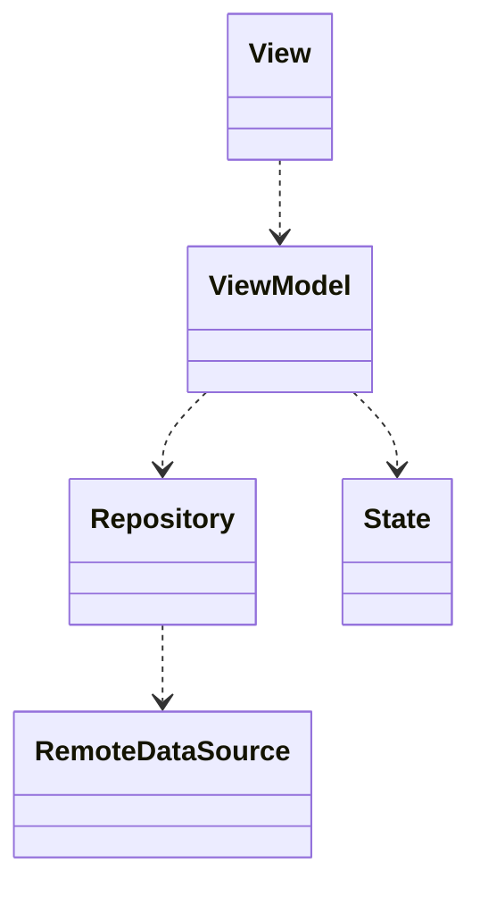

## flutter_simple_todo
簡単なTODOリストアプリです 

 

 
##  構成
- 状態管理パターンとしては`riverpod` + `flutter hooks` + `freezed`を採用
- DBはFireStoreを採用
- 画面遷移には`auto_route`を採用
 
## 設計
簡易的なMVVMパターンを採用

```mermaid
classDiagram
    View ..>  ViewModel 
    ViewModel ..> Repository
    ViewModel ..> State
    Repository ..> RemoteDataSource
```
